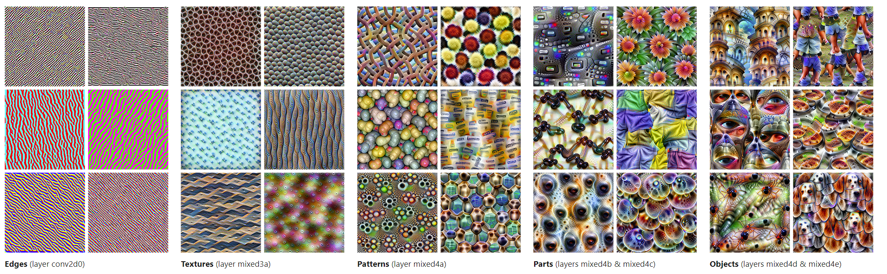
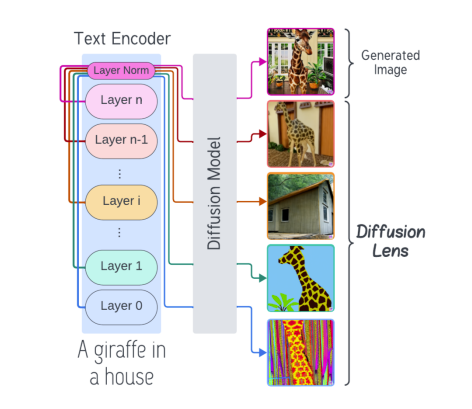
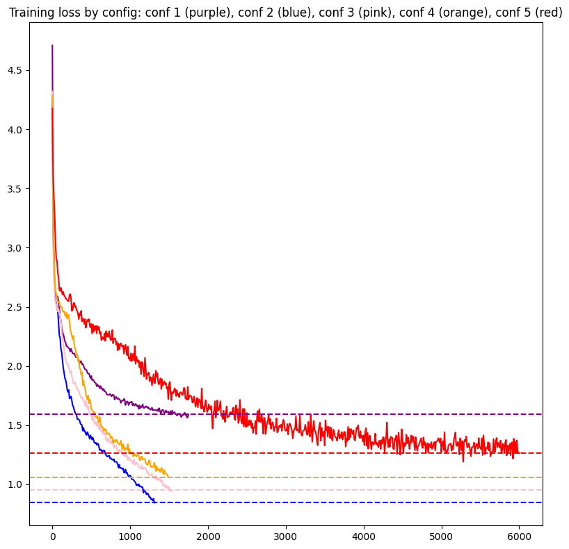
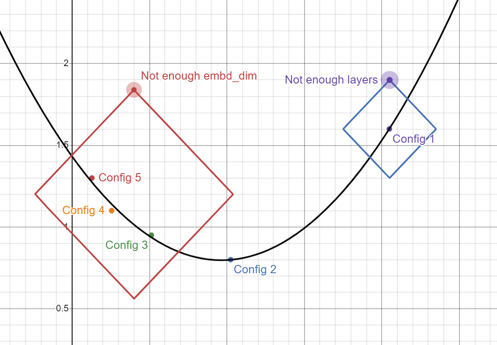

<link
rel="stylesheet"
href="https://cdn.jsdelivr.net/npm/katex@0.10.0-rc.1/dist/katex.min.css"
integrity="sha384-D+9gmBxUQogRLqvARvNLmA9hS2x//eK1FhVb9PiU86gmcrBrJAQT8okdJ4LMp2uv"
crossorigin="anonymous"
/>

# Whats better: Neural nets wider with less layers or thinner with more layers

This is just a short, simple blog post describing my experimentation around what I've seen as a common phrase around transformer neural nets, "more layers is better than wider layers".

As a disclaimer, I'd like to mention that I'm using nanogpt for the codebase ([github](https://github.com/VatsaDev/layersVdimension) and [kaggle nb](https://www.kaggle.com/code/vatsadev/layersexperiment)), so the FFN size, which is what I'm using to determine width, is $embd^2$, which means FFN width changes do affect my vector dimensionality, but I don't expect this to be too much of an issue, as I'm using tiny shakespeare, which is really sparse data, combined with the fact that in all my configs `embd_dim` never went below 3 digits, so any superposition happening should still happen with most of the effectiveness intact.

I also have 4 attention heads instead of two for my last two configs, because pytorch gave me the `sm_80 != sm_90` error, and my best reference online was this one guy on a pytorch issue mentioning attention heads should be a power of 2, so I did 4 because I guess $2^2$ works but $2^1$ doesn't?

## Theory on more layers v. wider layers

the more layers is better argument begins with the idea that by having more layers, you can have more, deeper representations of an idea, and I don't think anyone can argue against this, its foundational in Mechanistic Interprebility, like Anthropic's [visualizing features](https://distill.pub/2017/feature-visualization/), or the [Diffusion lens](https://arxiv.org/abs/2403.05846) paper.

_Some examples of the more layers = more sophisticated representation argument_

This argument later evolved into many people I've interacted with thinking that in a parameter equivalent setting, more layers would be better. I didn't necessarily think that would be true, mostly a gut feeling, but also that lowering the parameters per MLP in favor of more of them would have a detrimental effect.

My intuition leads me to begin with the hypothesis that the ideal config is going to be a balanced ratio between `n_layer` and `embd_dim`, probably with less than 10 layers for the 50m range, and a dimensionality of greater than a 1000.

## Training runs with parameter equivalent transformers

All the models are vanilla transformers from the NanoGPT codebase, all of them are parameter equivalent at 50 million parameters (Number comes from the largest 1 layer config that fit on my gpu). Everything here is trained from scratch. 

In all configs, the `embd_dim`, `n_head`, `n_layer` can all be represented by $2^x$, which helps with [NN training speed](https://x.com/karpathy/status/1621578354024677377), and making sure the transformer tensor shapes dimensions always being divisible (`assert config.n_embd % config.n_head == 0`, from the `CausalSelfAttention` code)

We can mathematically represent the relation as $\text{embd}^2 \propto \frac{1}{\text{num\_layers}}$, so everytime the `embd_dim` in configs is halved, the number of layers is increased 4x.

I haven't shown val losses here, but its evaluated every 250 steps, and it tends to be higher than the train loss by quite a bit ($\approx 0.1-0.2$), but thats also expected with dataset size, the val set can take big chunks from a couple plays.

Each run was terminated at a point where overfitting was shown (Val loss increasing for over 3 eval steps (1 eval step every 250 steps), or 750 steps)

Before you look at all the configs, look at the loss chart:

Now look at the config definitions:

 - Config 1 (Purple):
     - `embd_dim` 2048, `n_head` 2, `n_layer` 1
 - Config 2 (Blue)
     - `embd_dim` 1024, `n_head` 2, `n_layer` 4
 - Config 3 (Pink)
     - `embd_dim` 512, `n_head` 2, `n_layer` 16
 - Config 4 (Orange)
     - `embd_dim` 256, `n_head` 4, `n_layer` 64
 - Config 5 (Red)
     - `embd_dim` 128, `n_head` 4, `n_layer` 256

The best loss comes from Config 2, which was what my hypothesis predicted. The best results come from models with a balance between `n_layer` and `embd_dim`

Another of thinking of it like the optimum of the loss function in a basic NN:

Config 2 had enough of an embedding dim to learn the data's features, but also enough layers to make more representations and generalize better.

A good example of Config 2 at scale is probably Llama 3 8b, which has an embd_dim 4096 with a vocab_size 128k and 32 layers, enough to superposition and learn the features of 15 trillion tokens, probably the most fed to any model barring GPT-4 and claude's 3/3.5 series. Theres also 32 layers, which is probably enough to a decent amount of internal representations around 15T tokens, but Llama 3 70b probably froms many more, considering it has 80 layers

## Other observances around these training runs

Here are some other observations I made not really visible on the graph, or mentioned earlier 

with higher layer counts, initial loss would improve:
 - Config 1 had an Initial loss of 4.7
 - Config 2 at 4.2
 - Config 5 at 4.17

It is diminishing returns, but probably feels huge at the L3 8b vs L3 70b scale

The Different configs varied for time per step:
 - config 1: 600ms
 - config 2: 1000ms
 - config 3: 700ms
 - config 4: 750ms
 - config 5: 600ms

I also found that increasing layers rather than width greatly increases initialization time, ex. Config 1's `torch.compile` took around a minute, but config 5's took half an hour. 

Also MFU is layer correlated (mfu on a t4, assuming peak at 65 TFlops as everywhere reports)
 - config 1: 255% mfu (I genuinly do not know what happened here)
 - config 2: 10% mfu
 - config 3: 9% mfu
 - config 4: 7%
 - config 5: 2.5% mfu

I also expected a diff outcome from the extra attention heads, but adding more heads did nothing for loss, configs 4 and 5 aren't that different from the others.

## Conclusion

The experiments suggest that a balanced ratio between embedding dimension and number of layers yields optimal performance in parameter-equivalent transformer models. Future work could explore this relationship across different model scales, datasets, and architectures, or investigate how the optimal balance shifts with increasing model size and computational resources.

Personally I'd find these results for SSMs like RWKV/Mamba intresting, consider their "state space representations"
